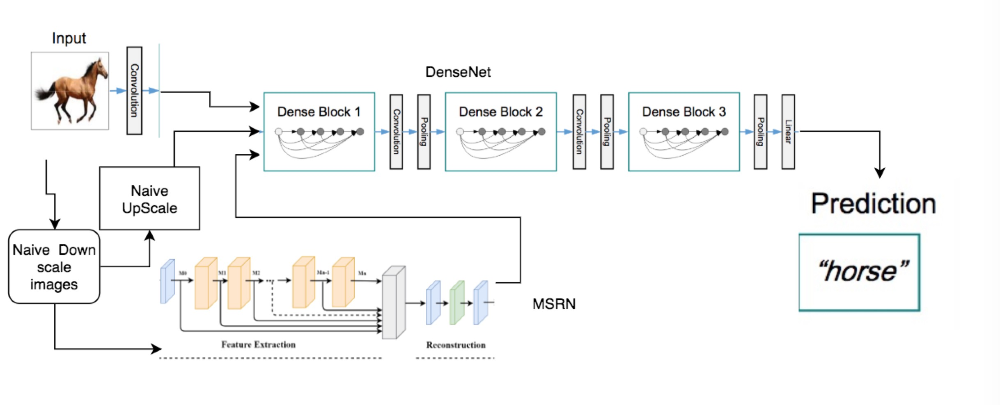

# CSI4106 Final Project

* This project is exploring the influences of image resolutions in classification.

* The project can be explained in following images



## Getting Started

* First install the dependencies

```bash
    pip install -r requiremnts.txt
```

* To Run the training
    * specified the model name in `train.py` with `model_name` in one of following
        1. `densenet64` for super resolutions densenet
        2. `densenet` for naive processed image densenet
        3. `msrn` for multi-scaled residual netowrk

* To tested with the network
    * run `jupyter notebook PROJECT_DIR`
    * and opens up demo.ipynb to show our training result.