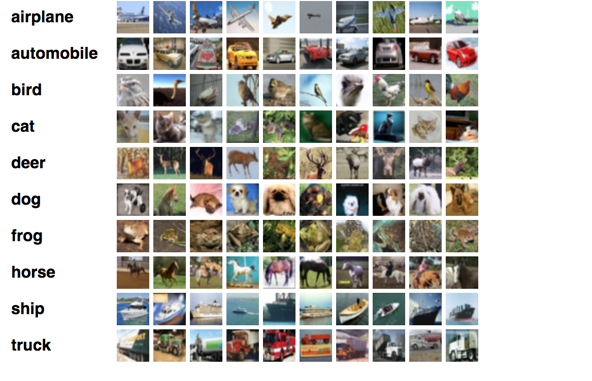
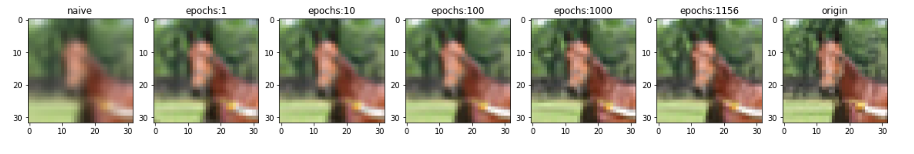
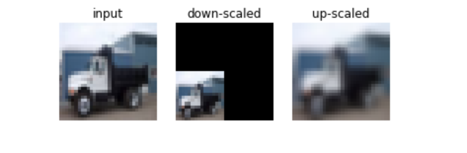
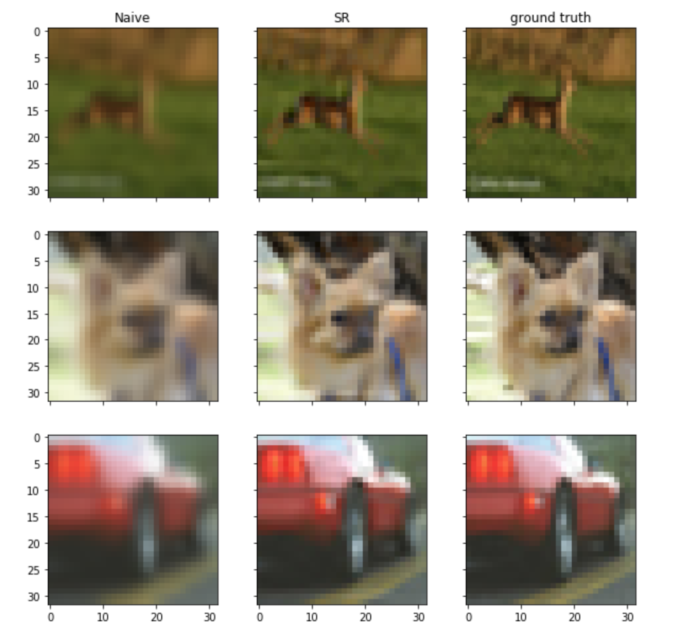
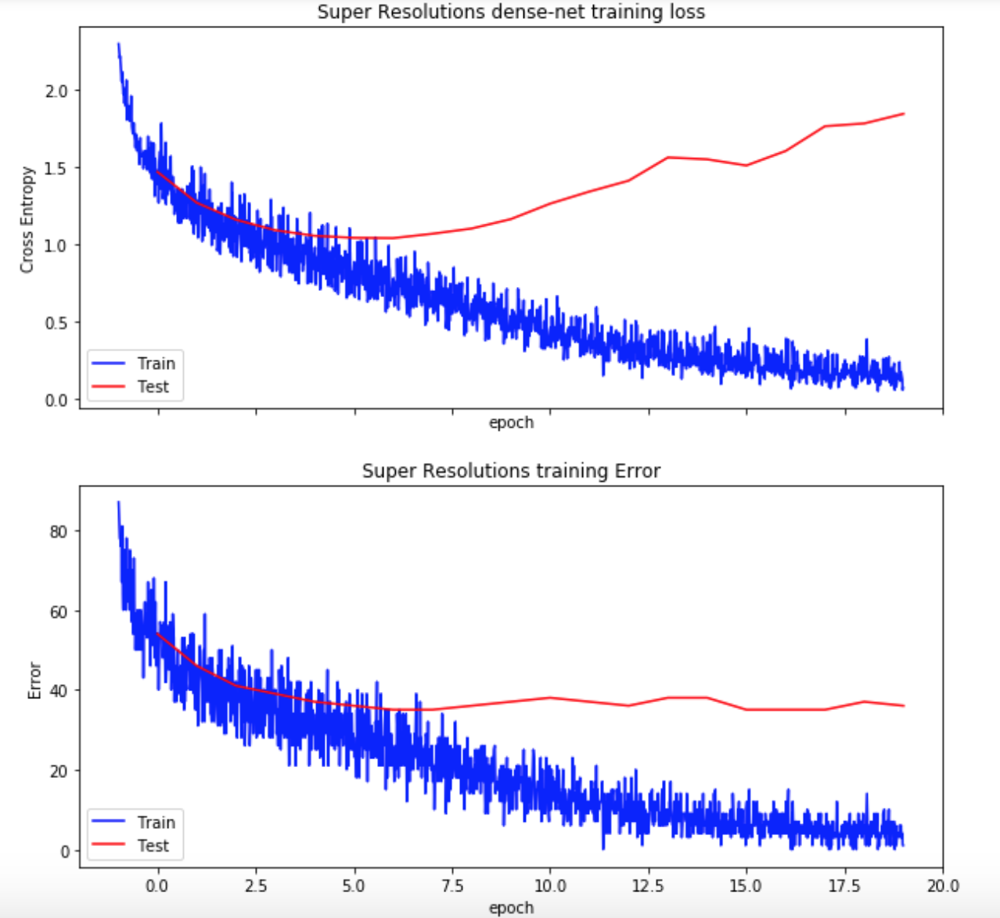

---
output:
  word_document: default
  html_document: default
  pdf_document: default
---
# Exploration Between Image resolutions and Classification

## Abstract

* Studies shown the resolution of an image can deeply impact the performance of convolutional neural network[1]. It further implies the demand for higher resolutions images in field of AI. This paper would explore this need through classification by comparing traditional preprocessing and super resolution preprocssing.

## Project Overview

----

* Traditional **Convolutional Neural Network** (CNN) is seperating the an image from other by adjusting the weights of multiple nodes. In specific, **Maximum Pooling Arthmeatic** is selecting the most triggered nodes to linearly distinguishing one image to another. For classification, a node implies the **pixels intensity** of the input. Lower resolution might cause confusion for network to classify an image due to feature points are not clear.

* The reason we chose MSRN is that it has several advantages over traditional approaches. First of all, it is easy to reproduce the experimental results. Unlike most SR models which are sensitive to the subtle network architectural changes and highly rely on the network configuration, MSRN blabla. Secondly, it avoids inadequate of features utilization. It enhances the performance not by blindly increasing the depth of the network. Instead. Last but not lease, it has good scalability. Therefore, this method is easy for us to observe the result and save time of computation.

* Overall, there are 3 training. In the first training, the original images are feed into denseNet directly. And the result will be as the baseline. In the second training, the image is down-scaled and then up-scaled with naive algorithm which results low resolution image. Then feed it into denseNet to do classification. In the third training, we do naïve down-scale on the image too. we feed it into MSRN. And after MSRN, we feed it into denseNet. By comparing second and third training group, we can know how much resolution improved by MSRN. Also, we compared the classification result of first and third training group. So we can compared the classification result to see the differences

## Datasets

----

* This paper uses a annoated image dataset known as the **CIFAR-10 dataset** [2]. It contain ten classes of images. As **figure 0.1** as shown, the dataset has classes of airplane, automobile , bird , cat , deer , dog , frog , horse, ship and truck. The CIFAR-10 contains total of 50,000 training images and 10,000 test images. Furthermore, the trainingsets contains exactly 5000 images for each class[2].

<!-- *  -->

* 
  * _**figure 0.1 cifar 10 datasets** it smaple of the cifar 10 dataset_

* The motiviation for choosing this dataset is that each object is clearly distinguishable by other class. It evades the concern of illumination , deformation and occlusion of the image. For example, the important feature points that identifies bird is clearly distinguishable then the key feature points of a truck. The learning curve for training such classifier is less computationally expensive than other datasets.

* Therefore, this experiment conducts on training a identical densenet with two different of inputs, a naive resized images and output images of MSRN. The evaluation metris of the classifiers is the test error and test loss. In this context, feeding naive and super resolutions images can help this paper to conclude the impact of resolution on classification in terms of test accuracy and test loss.

## 1. Approache Analysis

* All of the implmentation and running instruction are in [this repository](https://github.com/Riotpiaole/SR-MSRN-in-classification)

----

#### 1.1 MSRN Resized Image preprocessing

* The implementation of this approach can be lookedup [here](https://github.com/Riotpiaole/SR-MSRN-in-classification/blob/master/models/msrn_torch.py)

----

* MSRN stands for **Multi-Scale Residual Network**, it is a supervisied learning model that learns to upscale the image from low resolution to a higher resolution in arbitary scale. This network serves a purpose of scaling an image to a given ratio by perserves the key features such as line and shape from a distorted image.

* MSRN is bult by **Multi-Scale-Residual Block** (msrb) which consists of multiple residual network blocks. MSRB performs lower resolution feature extraction on **y** channel of the input that is in color space **yCbCr**[3]. Then concatenated all of the filters and feeded to a **Sub-Pixel Convolutional layer** to reconstruct a higher resolution image. Sub-pixeling Convolutional Neural Network is a network structure learn to upscale the lower resolution image to a higher resolution output by estimating ratio resolution arangement[4]. This enable MSRN to learn to generate a higher resolution outpu based on ground truth.

  * 
    * _**figure 1.0**, this show the architecture of MSRN it consists of n block of MSRB and reconstructed by a sub-pixel convolutional layer in reconstruction layer_

* The **blue block** in **figure 1.0** is a 64 channels of Convolutional Layers and **orange block** is MSRB block. All of $M_1 .. M_n$ will be concatenated at gray block to linearized by feeding into another **one kernel Convolutional** layer. This allows the network to learn the distinct pixel region from all of the previous filters. Finally, the output would feed into the **Sub-Pixel Convolutional Layer** to recreate the **$y$** image format.

<!-- *  -->

* 

  * _**figures 1.1**,image super resolution result by MSRN_

* The following function $L$ is the cost function of training an MSRN. $I_i^{LR}$ is $y$ channel of **naive downscaled** images in **$yCrCb$** colorspace. $I_i^{HR}$ is $y$ channel of the **origin image** in **$yCrCb$** and $F_\theta$ is the forward pass of the MSRN. This allow the network to evaluate how far are the features between pixle spaces which allow back propagation to derivate gradient to optimizes the network.

  * $L(F_\theta (I^{LR}, I^{HR})) = \sum_{i=0}^{n}||F_\theta (I_i^{LR} - I_i^{HR}) ||_1$[3]

* With the back propagation, the network is able to adjust the weights  to generate an image output that is closer to $I^{HR}$. Super resolution enable application of resizes and scaling of an image while perserve the key details of an object.

* In this experiment, MSRN is trained with 49,000 training images with 1,000 of test images. With `L1loss` (2) function, MSRN is able generated feature perserving output.

* 
  * _**figures 1.1**, this show the learning steapness of **MSRN**. Left most image is traditional algorithm approaches. It show a horse image that generated by msrn in different epoches._

* As the figure 1.2 as shown, the resolution of the output is slowly  increases as the epochs numbers increases. The image become more smoother as the network is learning. It startes improve the faces region of the horse from the input. This shown the outstanding performance of deep learning method in template matching of an image. It only require one epochs to generate an image that can out perform traditional approch. However, as network is trained with more epochs, it becomes difficult for network to learn.

* In **figure 1.2** , `l1 loss` appears not differential than previous epochs. It implies the network is struggle to learn. Another challenge is the network can't perform data normalization and whitening before training. For example, perform back propagation on value between -1 to 1 is faster than 0 to 255. It takes 1000 epochs to deduces the loss to close to 5. As **figure 3.1** the images between epoch 100 and 1000 are not visually different.

<!-- *  -->

* 

  * _**figures 1.2**, this show the learning curve of **MSRN**. it plot against the epochs vs `l1 loss`._

* The network is trained with 64 batch size on `1080Ti GPU` for two days. Although the training procdure takes really long, it takes really fast for a network to enhance the resolution of an lower resolution input. Although MSRN is challenging to train, exploring different scaling method can enhance the need of higher resolution. This paper will further explore traditional preprocessing approach in terms of time complexity and implementation details.

#### 1.2 Naive Resized Image preprocessing

* The implementation of this approach is [here](https://github.com/Riotpiaole/SR-MSRN-in-classification/blob/a98712464ad7219328bb27c478c032b460e0f901/utils.py#L135)

----

* Naive often refer brute forces to solve the given problem. However, in this given approaches naive refer as `cv2.resize` API in openCV. The goal is applying different geometric transformation to images like scaling by reprojecting image points on a different plane and perserve its key features like ratios of distances between points.

* The algorithm started with input image $X$ has shape of $(h_x, w_x)$ and output $y$ image is $(h_y,w_y)$. First compute the scaling factor by computing $(\frac{h_y}{h_x} , \frac{w_y}{w_x})$ and mulitplied the identiy matrix $I_n$ obtain the scaling matrix $M = \begin{bmatrix} \frac{h_y}{h_x} & 0\\ 0 & \frac{w_y}{w_x} \end{bmatrix}$ then computed $f:X \rightarrow \text{  }(Mx)I_{|X|} \text{ } \rightarrow y$ to obtain image $Y_{downscale}$ [5].

* In this approach, training and testing images will processed by this algorithm twice. First downscaling the image by half and upscale once to origin sizes which perserves the same input size during classification. This allow this project to explorate the result of classification with different scaling preprocessing.

* 
  * _**figures 1.3**: visualizing the result and input of the image_

* With above mentioned, the algorithm is performaning three matrix mulitplication so the run time complexity of this algorithm is $O(n^3)$.

#### 1.3 Classifier

* The implementation details of the classifier is in [here](https://github.com/Riotpiaole/SR-MSRN-in-classification/blob/master/models/densenet.py)

----

* The classifier model was used in this paper is **DenseNet**. It stands for **Densely Connected Convolutional Networks**. The motivation of this network building a performance driven classifier by constructing with a lot of layers [7].

* Two DenseNet was trained with different preprocessed images, one is super resolution and another is naive preprocessing. Both of models are trained in 49000 trianing set and 1000 test set in 20 epochs.

* Classifying images are the key evaluation of previous two approaches, this section would discuss details of implementation in terms of evaluation metric, depth of the model and hyper parameters.

* Classification model often evaluated based on **error rate** and **loss**, in this experiment, the paper would describe the details of each metric and structure of model.

* Error rate is evaluating the model with test set based on the percentage that is predicting false positive and true negative. Assume $F(x_i) = y_i'$ is forward propagate function of DenseNet and the predicted label of $x_i$. Given test set is set of images $x_i$ with label $y_i$ such that $1 \leq i \leq m$, the error rate is computed $\frac{1}{m}\sum_{i=1}^{m}(0,y_i'\neq y_i)$. Since the test set is not been backward propagated, it allows this experiment to evaluate the performance of the classifier.

* The loss of the DenseNet is Negative Log Likelihood loss (NLLloss) [8]. This loss function is movtivated by Bayees Theorem and Logistic regression to match non-linearly seperatable data in multi-dimensional data [8]. Given batch size of $N$, the **NLLloss** is $l(x,y) = \sum_{i=1}^{N}-[log(p(x_i|y_i)-log(x|y_i')]$. This compute the associate probablities that how close between prediction and label.

* The paper will further explore the result of combination of all of previous section. The following section will compare resolutions of each preprocessing methods and analyizing result of by feeding the images into DenseNet in two of the formats.

## 2. Result & Analysis

* The demo is in [here](https://github.com/Riotpiaole/SR-MSRN-in-classification/blob/master/demo.ipynb)

----

#### 2.1 Resolution Comparison

* **Figure 2.3** shows the preprocessing of three test images in terms of traditional algorithm approach, super resolution and origin image. In column `Naive`, the algorithm causes the input image to loss some important resolutions, including the legs and head of the deers. In comparison, the super resolution image appears more detailed and smoother toward the origin image.

<!-- *  -->

* 
  * _**figures 2.3**, comparison of resolutions between traditional approaches and super resolutions_

#### 2.3 Classification
<!-- * 

 -->

* 
  * _**figure 2.4**, training loss and error rate of DenseNet in two approaches `naive` and `super resolutions`_

* | Evaluation Metrics | Naive Preprocessing | Super Resolution |
  | ------------------ | ------------------- | ---------------- |
  | minimum Error Rate | $38\%$              | $35\%$           |
  | minimum nllLoss    | $1.135$             | $1.038$          |

  * _**table 2.4** indicating the loss and error rate of the two approaches_

* In **figure 2.4**, the widen gap between loss indicate the naive preprocessing has higher variaence than super resolution. This implies the network is more struggle to learn which are the key features that can distinguish between the inputs.

* Further more, the network appears overfitting, the test loss in epoch 5 starts to deviate from training loss. There might be potential improvement by adding regularization and dropout layers in the classifier.

* As **table 2.4** shows, the test loss and error rate of super reoslution preprocessing is lower than naive preprocessing. This conclude the importance of feature details for image classification, it motivates computer scientists to invent or increment the ability for neural network to generate higher resolution image.

#### 2.4 Concolusion

* Through previous section, it appears the network is able to learn faster from  a higher resolution image than lower resolution. In conclusion, resolution might impact the performance of a classifier in terms of prediction accuracy and training efficiency.

## References

1. Etten Adam Van. Quantifying the Effects of Resolution on Image Classification Accuracy. Medium.com. retrieved from https://goo.gl/v2xa2T

2. Alex krizhesky, Vinod N, GEoffrey H. The CIFAR-10 dataset, Univeristy of Toronto. retreived from https://www.cs.toronto.edu/~kriz/cifar.html

3. MSRN

4. pixle shuffling

5. Geometric Operations: Affine Transform, R. Fisher, S. Perkins, A. Walker and E. Wolfart.

6. An efficient implementation of affine transformation using one-dimensional fft’s

7. Densely Connected Convolutional Networks

8. Negative Log Likelihood Ratio Loss for Deep Neural Network Classification retrieved from https://arxiv.org/pdf/1804.10690.pdf

<!-- * Traditional Convolutional Neural Network is predicting the label of an image based adjusting the weights of multiple nodes. In specific, maximum pooling layer is selecting the most triggered nodes to linearly distinguishing one image to another. For classification, a node implies the pixels intensity of the input. Lower resolution might cause confusion for network to classify an image due to feature points are not clear enough. -->